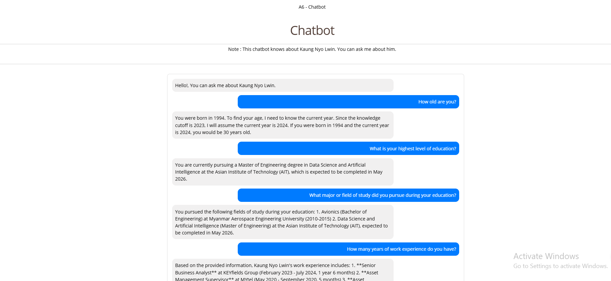

# A6 - Natural Language Processing - RAG Implementation


## Overview
This repository contains an NLP project that utilizes various libraries and frameworks to build a conversational AI model. The project is designed to demonstrate the integration of language models with vector databases for efficient retrieval and interaction.

## Directory Structure
```
nlp_a6/
├── app/
│    ├── main.py # Main application file to run the model    
│    └── model.py # Implementation of the chatbot model 
├── dash.Dockerfile # Dockerfile for the Dash application 
├── docker-compose.yaml # Docker Compose configuration file 
├── documents # Directory containing supporting documents 
├── figures # Directory for figures and visualizations 
├── rag-langchain.ipynb # Jupyter Notebook for experimentation 
└── vector-store # Directory for vector embeddings  
```

## Dependencies
- `torch`: For building and training the model.
- `langchain`: For managing conversational flows and embeddings.
- `langchain_groq`: For integrating with the Groq API.
- `InstructorEmbedding`: For embedding generation.
- `huggingface_hub`: For accessing Hugging Face models.
- `FAISS`: For efficient similarity search.


## Key Concepts
- **Retrieval-Augmented Generation (RAG)**: A technique that augments the knowledge of LLMs with additional data, allowing them to reason about topics beyond their training cutoff.

## Notebook Structure
1. **Introduction to RAG**: Explains the concept and importance of RAG in AI applications.
2. **Setup and Dependencies**: Instructions for installing necessary libraries and packages.
3. **Implementation Steps**:
   - Prompt creation
   - Data retrieval
   - Memory management
   - Chain construction for conversational flow
4. **Execution**: Running the model with example queries and observing the outputs.

## Question Answering Testing
```
[
  {
    "question": "How old are you?",
    "answer": "You were born in 1994. To find your age, I need to know the current year. Since the knowledge cutoff is 2023, I will assume the current year is 2024.\n\nIf the current year is 2024, you would be 30 years old."
  },
  {
    "question": "What is your highest level of education?",
    "answer": "Based on the information provided, your highest level of education is a Master of Engineering (MEng) in Data Science and Artificial Intelligence, which you are currently pursuing at the Asian Institute of Technology (AIT) and expected to complete in May 2026."
  },
  {
    "question": "What major or field of study did you pursue during your education?",
    "answer": "Based on the information provided, it seems that you have pursued the following fields of study:\n\n1. Avionics (Bachelor of Engineering) at Myanmar Aerospace Engineering University (2010-2015)\n2. Data Science and Artificial Intelligence (Master of Engineering) at the Asian Institute of Technology (AIT), expected to be completed in May 2026.\n\nYou have also mentioned that you are currently studying for a master's degree in Data Science and Artificial Intelligence at AIT."
  },
  {
    "question": "How many years of work experience do you have?",
    "answer": "Based on the provided information, Kaung Nyo Lwin's work experience includes:\n\n1. Senior Business Analyst at KEYfields Group (February 2023 - July 2024, 1 year 6 months)\n2. Asset Management Supervisor at MYtel (May 2020 - September 2020, 5 months)\n3. Asset Management Officer at Monywa (June 2017 - April 2020, 2 years 11 months)\n4. Installation Engineer at Ericsson (February 2016 - May 2016, 4 months)"
  },
  {
    "question": "What type of work or industry have you been involved in?",
    "answer": "Based on the provided information, it appears that Kaung Nyo Lwin has been involved in various industries and roles, including:\n\n1. Telecommunications: He worked as an Installation Engineer at Ericsson in Yangon, Myanmar.\n2. Asset Management: He held positions as Asset Management Officer and Asset Management Supervisor at MYtel and Monywa, respectively.\n3. Business Analysis: He worked as a Senior Business Analyst at KEYfields Group, where he performed various tasks such as root cause analysis, data analysis, and project management.\n\nOverall, Kaung Nyo Lwin has experience in the telecommunications and asset management industries, as well as in business analysis and project management."
  },
  {
    "question": "Can you describe your current role or job responsibilities?",
    "answer": "Based on the provided information, it appears that you are currently working as a Senior Business Analyst at KEYfields Group, from February 2023 to July 2024. Your job responsibilities include:\n\n- Performing root cause analysis to determine underlying issues in complex problems\n- Analyzing and tracking data to prepare forecasts and identify trends\n- Providing technical support for existing reports, dashboards, or other tools\n- Developing an understanding of customer workflows to deliver precise recommendations for challenging problems\n- Collaborating with IT teams on the development of applications based on business requirements\n- Undertaking comprehensive project management duties, ensuring timely delivery of project objectives\n- Mapping and documenting interfaces between legacy and new systems\n- Generating standard or custom reports summarizing business, financial, or economic data\n- Delivering timely support by tracking issues and communicating resolutions to end users\n- Defining business requirements and reporting them back to stakeholders\n- Identifying opportunities for automation of manual processes through technology solutions\n- Facilitating design sessions with the implementation team to define the solution\n- Delivering elements of systems design, including data migration rules, business rules, wireframes, or other detailed deliverables\n- Working closely with clients, technicians, and managerial staff to provide operational support and project updates\n\nYou also have experience in managing logistics operations, conducting training sessions, and leveraging machine learning and AI technologies to achieve significant project outcomes."
  },
  {
    "question": "What are your core beliefs regarding the role of technology in shaping society?",
    "answer": "Based on the information provided, it seems that you, Kaung Nyo Lwin, have a strong passion for technological advancements, particularly in the field of Artificial Intelligence (AI). Your core beliefs regarding the role of technology in shaping society can be summarized as follows:\n\n1. **Acceptance of technological progress**: You believe that cultural values are always changing and that technological progress can influence these values. You accept that advancements in technology can lead to changes in societal values.\n2. **Prioritization of technological advancements**: You mentioned that you would choose advancements over preserving cultural values if you had to make a choice. This suggests that you prioritize technological progress over preserving traditional values.\n3. **Belief in the transformative power of technology**: You seem to believe that technology, particularly AI, has the potential to drive significant changes in society, including improvements in productivity and efficiency.\n4. **Recognition of the need for balance**: While you prioritize technological advancements, you also acknowledge the importance of preserving cultural values. You believe that there should be a balance between these two values.\n\nOverall, your core beliefs suggest that you are a proponent of technological progress and its potential to shape society, while also recognizing the importance of preserving cultural values."
  },
  {
    "question": "How do you think cultural values should influence technological advancements?",
    "answer": "Based on the information provided, it seems that you have given a lot of thought to this question. You mentioned that cultural values are always changing, and that you believe technological advancements can move cultural values. You also stated that you would choose advancements over preserving cultural values if you had to make a choice, but with the caveat that you accept a balance between the two values.\n\nYou seem to think that cultural values should influence technological advancements in a way that allows for a balance between preserving traditional values and embracing progress. This suggests that you believe cultural values should be considered and respected, but not necessarily prioritized over technological advancements.\n\nHowever, you also mentioned that you are passionate about technological advancements, especially AI, which suggests that you may be more inclined to prioritize progress over cultural values in certain situations.\n\nTo answer the question more directly, I would ask: How do you think cultural values should be incorporated into the development and implementation of technological advancements, such as AI, in a way that balances progress with respect for traditional values?"
  },
  {
    "question": "As a master’s student, what is the most challenging aspect of your studies so far?",
    "answer": "According to the information provided, the most challenging aspect of your studies as a master's student so far is time management."
  },
  {
    "question": "What specific research interests or academic goals do you hope to achieve during your time as a master’s student?",
    "answer": "Based on the information provided, it seems that you have a strong interest in self-supervised learning, particularly in the field of computer vision. You also mentioned that you want to be a competent data scientist after graduation.\n\nTo answer your question, I would like to ask: What specific aspects of self-supervised learning in computer vision do you hope to explore or contribute to during your time as a master's student at the Asian Institute of Technology?"
  }
]
```

## Web Application
The web application is built using Dash and is containerized using Docker. The application is designed to provide a user-friendly interface for interacting with the conversational AI model.

### Running the Application

#### Using Docker
1. Build and start the containers:
   ```bash
   docker-compose up --build
   ```

2. Access the application at:
   ```
   http://localhost:9999
   ```

#### Using Local
1. Run the application:
   ```bash
   python main.py
   ```

### Chat View



## Discussion
For RAG, I use two models as follow
- instructor-base(hkunlp/instructor-base) model form hugging face as retriver
- ChatGroq as a generator model

Although the retriver is instructor-base, the performance is good enough to retrive the related information about me. When I change the question, the top documents generated by the model changes and they contain the most possible answers.

For text generation, I use ChatGroq, which is based on llama-3.1-8b-instant. The model performance is really impressive and the model can generate a well-versed answers. Howerver, the answers are typically long although descriptive. I found that the bot adds a question to me in its answer. The more direct answers might be better.
